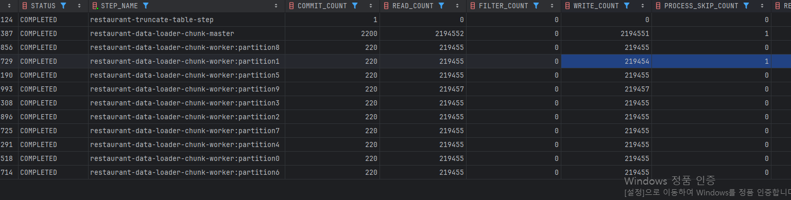

# 테스트 환경
- 프로세서	Intel(R) Core(TM) 5 120U, 1400Mhz, 10 코어, 12 논리 프로세서
- 도커 : 10코어 12스레드라서, 도커에서 12 CPU 로 인식
    - DB CPU 사용량 :
        - 1~ 3차 테스트 중 1200% 중 80% 정도 사용중으로 안정적?..
          ex) 600% 사용 6코어 사용중. 나는 80%면 너무 작은거 0.79코어
        - 4차는 증가 예정
        - 메모리 : 7기가 중 658MB사용중
- 배치 기동 로컬 CPU 90% 까지 찍어서 느린건가..

# 테스트 설정값
- chunk step 스레드 파티션 병렬 처리
- 1차 ~ 3차 chunk 1000, 파티션 5, 스레드 10
- 4차 cpu가 넉넉한거같아서 파티션 10 으로 증가, 스레드 10

# 1차 테스트
- 200만건 row데이터
- 1간이 넘도록 50만건정도 처리..local 환경이긴해도 너무 느림


# 2차 테스트
- 200만건 row데이터
- 멀티스레드 파티션 적용.
- 각 스레드가 200만건을 gridSize 10으로 파티션을 나눠 처리해서 약 20만씩 처리
- 약 한시간동안 160만건까지  향상되긴했지만 데이터가 쌓일 수록 느려지고있음..


# 3차 테스트
- 테이블에 여러개의 컬럼에 인덱스가 있어 불필요한 인덱스 삭제 후 다시 테스트
- 1738.467초 27분
  2,194,552 row - 2,175,754 = 총18,799 가 유실... 로깅 내용에 reader에 파일이 스킵됐다는 로깅이있음...중간에 파일을 접속했었는데 그게 문제인가...?

# 4차 테스트
- chunk 1000, 스레드 10, 파티션 5=> 10, skip limit 100으로 재테스트
- 목표 : CPU 사용량 증가 및 데이터유실...확인...
- 결과 : 처리 건수 2,194,551 write 성공, processor 처리중 1건 날짜 데이터 오류로 skip
- 파티션을 증가 해도 시간은 비슷하게 나옴.
  

# 5차 테스트
- DB Hikari 설정을 바꿔봄
  ```
  connection-timeout: 20000        # 커넥션 타임아웃은 20초로 조금 더 타이트하게
  maximum-pool-size: 50            # 파티션 + thread 대비 넉넉하게 확보
  minimum-idle: 20                 # 스레드 수 기준으로 idle 커넥션도 늘림
  idle-timeout: 300000             # 유휴 커넥션 유지 시간은 줄여도 무방 (5분)
  max-lifetime: 1800000            # 기본 30분 유지 OK
  ```
- 스레드풀 10 => 20
- 파티션 10 => 20
- 이거만 해보고 안되면 인덱스 drop 후 끝나면 다시 create 방식 적용해보기 -> 바로 중단 CPU 100% 메모리도 거의 15기가중 12기가
-

```최종 정리
싱글스레드 → 멀티스레드 + 파티셔닝으로 전환하여 처리 시간 50% 이상 개선
불필요한 인덱스 제거로 latency 감소 + DB I/O 최적화
파티션 증가로 CPU 사용률을 향상시키며 병렬 처리 효율 극대화
```

## 성능 최적화
1. 청크 기반 처리: 큰 데이터셋을 작은 청크로 나누어 처리하여 메모리 사용 최적화
2. 멀티스레딩*: 병렬 처리를 통한 처리 속도 향상
3. 배치 삽입: 데이터베이스 삽입 작업을 일괄 처리하여 IO 최소화
4. Connection Pool: HikariCP를 통한 데이터베이스 연결 관리****
